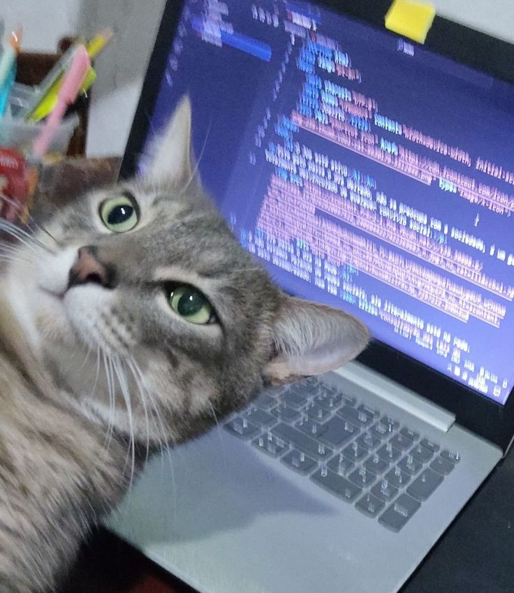

# sandeepkumar.dev

Hello, this is **Sandeep!** Thanks for visiting my GitHub and portfolio.

**serving at:** [sandeepkumar.dev](https://sandeepvsk10.github.io/sandeepkumar.dev)



Find me on X: [@sandeepvsk10](https://x.com/sandeepvsk10)

## About

This is my personal portfolio site, built with Next.js App Router, React, TypeScript, and Tailwind CSS.

## Pages

The project currently has 7 app pages:

- `/`
- `/cool-companies`
- `/dev-setup`
- `/neo4j`
- `/open-source`
- `/python`
- `/thamizh`

## Development

```bash
npm install
npm run dev
```

Useful scripts:

- `npm run dev` starts the local development server.
- `npm run build` creates a production build.
- `npm run lint` checks the code with ESLint.
- `npm run preview` serves the exported `out` directory.

## Thanks

Thanks to the package maintainers and devs behind the tools used in my portfolio.

- [GSAP](https://gsap.com/)
- [Lucide React](https://lucide.dev/)
- [Motion](https://motion.dev/)
- [Next.js](https://nextjs.org/)
